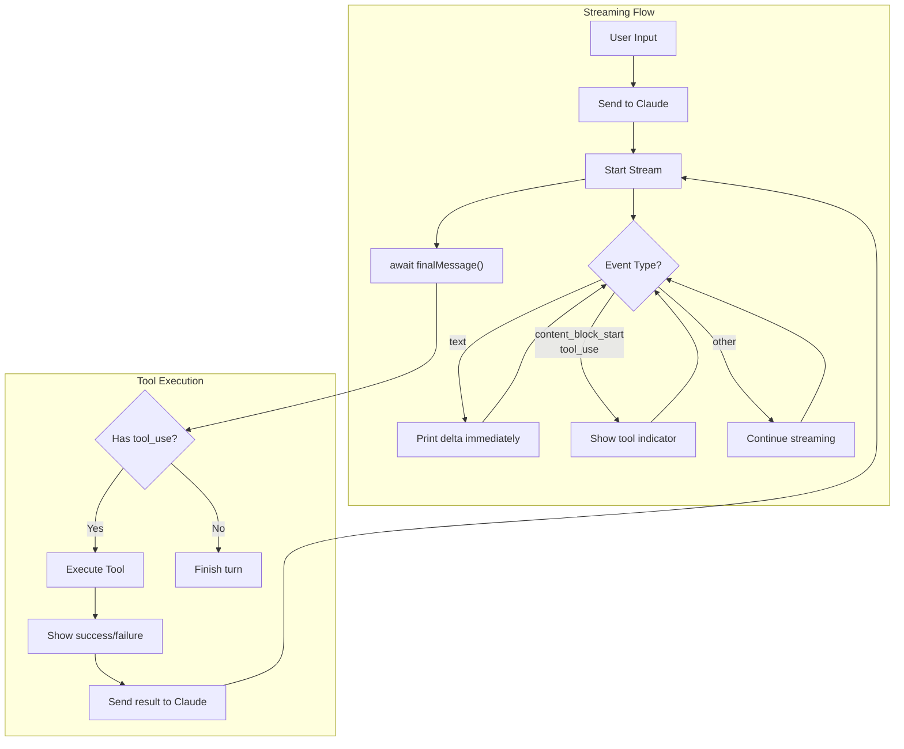
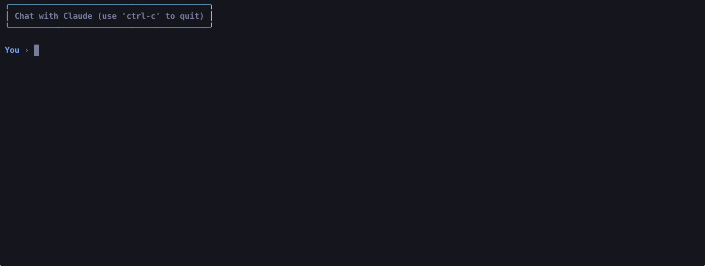

# Chapter 6: Streaming Responses

In this chapter, we enhance the user experience by implementing streaming responses. Instead of waiting for Claude's entire response before displaying it, text now appears as it's generated, and tool calls are visible the moment Claude decides to use them.

## The Goal

Make the agent feel responsive and transparent by:
1. Streaming text as Claude generates it (no more waiting)
2. Showing tool calls immediately when they start
3. Displaying tool execution status (success/failure)

## New Features

### 1. Streaming Text Output
Previously, text only appeared after Claude's full response was received. Now we use the SDK's streaming API to display text character-by-character as it arrives.

```typescript
stream.on("text", (delta) => {
  console_out.claudeStream(delta);
});
```

### 2. Tool Call Visibility
Users can now see when Claude decides to use a tool, before the tool even executes. This is done by listening to `streamEvent` for `content_block_start` events:

```typescript
stream.on("streamEvent", (event) => {
  if (
    event.type === "content_block_start" &&
    event.content_block.type === "tool_use"
  ) {
    console_out.toolStart(event.content_block.name);
  }
});
```

### 3. Tool Execution Status
After each tool runs, we now show whether it succeeded or failed:
- `✓ Finished tool_name` — tool completed successfully
- `✗ Failed tool_name` — tool encountered an error

## Anthropic Streaming Events

The SDK provides several events for streaming:

| Event | Description |
|-------|-------------|
| `text` | Text deltas as they arrive |
| `inputJson` | Tool input JSON as it streams (for showing args being built) |
| `contentBlock` | Emitted when a content block is complete |
| `streamEvent` | Raw access to all underlying events |

### Raw Event Types

| Event Type | When |
|------------|------|
| `content_block_start` | A new block begins (text or tool_use) |
| `content_block_delta` | Incremental data arrives |
| `content_block_stop` | Block finished |

## File Structure

```
6-streaming-response/
├── index.ts              # Entry point
├── agent.ts              # Agent with streaming support
├── types.ts              # Shared interfaces
├── ripgrep/              # Ripgrep downloader
│   └── index.ts
└── tools/
    ├── list_files.ts
    ├── read_file.ts
    ├── bash_tool.ts
    ├── edit_tool.ts
    ├── grep.ts
    └── tool_description/
        ├── bash.txt
        ├── edit_file.txt
        ├── grep.txt
        ├── list_files.txt
        └── read_file.txt
```

## Key Changes from Chapter 5

### agent.ts
- Changed `console_out.claude()` to `console_out.claudeStream()` for streaming output
- Added `streamEvent` listener to show tool calls as they start
- Added `console_out.toolEnd()` calls after tool execution
- Removed duplicate text printing (was printing via stream AND iterating content blocks)

### console.ts (shared)
Added three new methods:
- `claudeStream(delta)` — prints text without newlines (uses `process.stdout.write`)
- `toolStart(toolName)` — shows tool call indicator
- `toolEnd(toolName, success)` — shows execution result

### types.ts
- Added `required` field to `GenerateSchema()` so Claude knows which parameters are mandatory

## Flow Diagram



## How to Run

```bash
# Standard run
bun run 6-streaming-response/index.ts

# With debug logging
bun run 6-streaming-response/index.ts --verbose
```

## Example Session




## What's Next?

With streaming in place, future chapters could explore:
- **Thinking/reasoning display** — show Claude's thought process with extended thinking
- **Progress indicators** — show progress for long-running tools
- **Cancellation** — allow users to abort mid-stream
- **Parallel tool execution** — run multiple tools concurrently
