# Chapter 7: Extended Thinking

In this chapter, we add extended thinking capabilities to make Claude's reasoning process visible. Instead of only seeing the final answer, you can now watch Claude think through problems step-by-step with visual indicators showing when reasoning is happening.

## The Goal

Make Claude's thought process transparent by:
1. Enabling extended thinking with the Anthropic API
2. Streaming thinking content as it's generated
3. Displaying thinking blocks with clear visual cues

## New Features

### 1. Extended Thinking API

We enable Claude's extended thinking mode with a generous token budget:

```typescript
const stream = this.client.messages.stream({
  model: "claude-sonnet-4-20250514",
  max_tokens: 16000,
  thinking: {
    type: "enabled",
    budget_tokens: 10000,
  },
  messages: conversation,
  tools: anthropicTools,
});
```

### 2. Thinking Content Streaming

Claude's thinking appears in real-time as it's generated, styled in dimmed cyan to differentiate from regular responses:

```typescript
stream.on("streamEvent", (event) => {
  if (event.type === "content_block_delta" &&
      event.delta.type === "thinking_delta") {
    console_out.thinkingStream(event.delta.thinking);
  }
});
```

### 3. Visual Thinking Indicators

Thinking blocks have clear visual boundaries:
- `💭 Thinking...` — header when thinking begins
- Dimmed cyan text — the actual thinking content
- Blank line separator — marks the end of thinking

## Anthropic Thinking Events

The streaming API provides specialized events for thinking content:

| Event Type | When | Content |
|------------|------|---------|
| `content_block_start` | Thinking block begins | `content_block.type === "thinking"` |
| `content_block_delta` | Thinking content arrives | `delta.type === "thinking_delta"` |
| `content_block_stop` | Thinking block ends | Block finished |

## File Structure

```
7-thinking-tokens/
├── index.ts              # Entry point
├── agent.ts              # Agent with thinking support
├── types.ts              # Shared interfaces
└── tools/
    ├── list_files.ts
    ├── read_file.ts
    ├── bash_tool.ts
    ├── edit_tool.ts
    └── grep.ts
```

## Key Changes from Chapter 6

### agent.ts
- Added `isThinking: boolean` flag to track thinking state
- Configured thinking API with 10000 token budget
- Added `handleStreamEvent()` method to process thinking events:
  - Detects `content_block_start` with `type === "thinking"`
  - Streams thinking deltas with `thinking_delta`
  - Closes thinking blocks on `content_block_stop`

### console.ts (shared)
Added three new methods for thinking visualization:
- `thinkingStart()` — displays 💭 header
- `thinkingStream(delta)` — prints dimmed cyan thinking text
- `thinkingEnd()` — adds separator line

## Flow Diagram

```mermaid
graph TB
    subgraph "Streaming with Thinking"
        A["User Input"] --> B["Send to Claude"]
        B --> C["Start Stream"]
        C --> D{"Event Type?"}
        D -->|content_block_start<br/>thinking| E["Show 💭 Thinking..."]
        D -->|thinking_delta| F["Stream thinking text"]
        D -->|text_delta| G["Stream response text"]
        D -->|content_block_start<br/>tool_use| H["Show tool indicator"]
        D -->|content_block_stop| I{"Was thinking?"}
        I -->|Yes| J["End thinking block"]
        I -->|No| K["Continue"]
        E --> D
        F --> D
        G --> D
        H --> D
        J --> D
        K --> D
        C --> L["await finalMessage()"]
    end

    subgraph "Tool Execution"
        L --> M{"Has tool_use?"}
        M -->|Yes| N["Execute Tool"]
        N --> O["Show success/failure"]
        O --> P["Send result to Claude"]
        P --> C
        M -->|No| Q["Finish turn"]
    end
```



## How to Run

```bash
# Standard run
bun run 7-thinking-tokens/index.ts

# With debug logging
bun run 7-thinking-tokens/index.ts --verbose
```

## Example Session

```
You › Find all TypeScript files with potential bugs

💭 Thinking...
I need to search for TypeScript files first, then examine them for common bug patterns like unhandled promises, type assertions, or missing error handling.

⚡ Calling grep
✓ Finished grep

Claude › I found 12 TypeScript files. Let me analyze them for potential issues...

💭 Thinking...
Looking at the grep results, I see several files with 'any' types and unhandled async operations. I should prioritize checking error handling in agent.ts and the tool implementations.

⚡ Calling read_file
✓ Finished read_file

Claude › I've identified 3 potential issues in your code:
1. agent.ts:103 - Unhandled promise rejection
2. tools/bash_tool.ts:45 - Using 'any' type
3. tools/edit_tool.ts:78 - Missing error boundary
```

## What's Next?

With thinking capabilities in place, future enhancements could include:
- **Thinking summaries** — condensed view of long reasoning chains
- **Thinking history** — save and review past reasoning
- **Interactive thinking** — pause and query Claude's reasoning mid-stream
- **Thinking analytics** — measure reasoning complexity and depth
