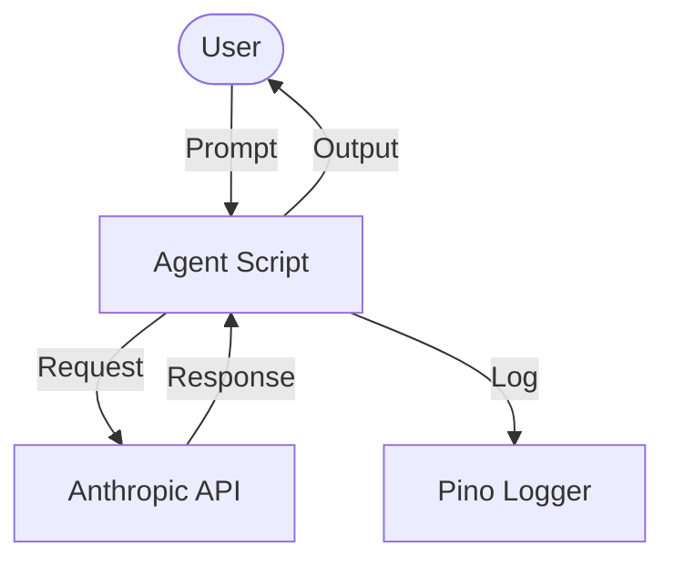
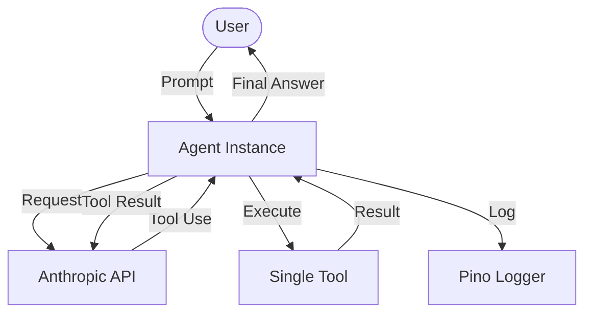
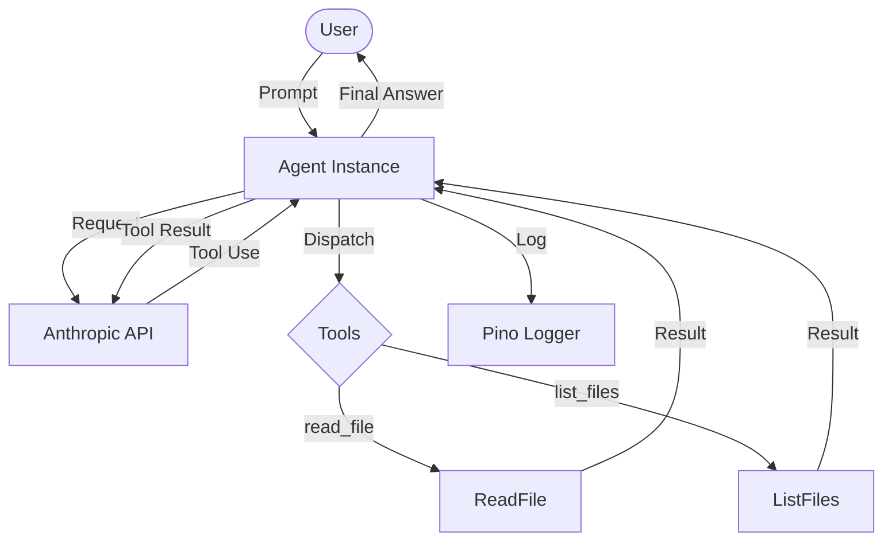
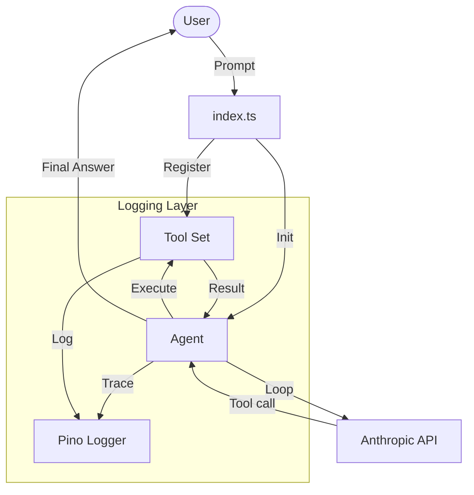

# AI Coding Agent Framework (TypeScript)

This repository demonstrates the step-by-step evolution of a modular AI coding agent framework built with TypeScript and the Anthropic SDK.

## Project Overview

The project is structured into chapters, each representing a distinct iteration in the agent's development—from a simple message loop to a mature, tool-capable framework.

### Chapters

- **[Chapter 1: The Inception](./chapter1)**: Establishing the fundamental message loop and CLI interaction.
- **[Chapter 2: Introducing Tools](./chapter2)**: Adding the first tool (`read_file`) to enable file reading capabilities.
- **[Chapter 3: Extending Tools](./chapter3)**: Extending the tool set with `list_files` following the same pattern.
- **[Chapter 4: The Framework](./chapter4)**: Separating Agent from Tools into a modular, extensible architecture.

## Evolutionary Overview

The following illustrations track the development of the framework's architecture, now fully integrated with structured logging.

### Chapter 1: The Monolithic Loop


### Chapter 2: The Tool Loop


### Chapter 3: Multiple Tools


### Chapter 4: The Framework


## Architecture & Core Patterns

### Structured Logging (Pino)
A central pillar of this framework is structured, high-performance logging. We moved away from `console.log` to **Pino**, allowing for:
1. **Log Levels**: Discerning between `debug` traces (reasoning) and `info` results.
2. **Machine-Readable**: Structured JSON output for downstream analysis.
3. **Performance**: Minimal overhead even in heavy agentic loops.

### Idiomatic TypeScript
The project prioritizes standard TypeScript patterns over custom abstractions. 
- **Error Handling**: Uses standard `try-catch` blocks for clear, predictable failure paths.
- **Type Safety**: Leverages strict typing and interfaces to define the contract between the Agent and its Tools.
- **Zod Schemas**: Uses Zod for both runtime validation and automatic generation of JSON schemas for the LLM.


### Key Dependencies

- **[Anthropic SDK](https://github.com/anthropics/anthropic-sdk-typescript)**: Powers the inference loop and message handling.
- **[Commander](https://github.com/tj/commander.js)**: Provides the CLI argument parsing.
- **[Zod](https://zod.dev)**: Used for data validation and generating JSON schemas for tools.

## Getting Started

1. **Install Dependencies**:
   ```bash
   bun install
   ```
2. **Configure API Key**:
   ```bash
   export ANTHROPIC_API_KEY='your-key-here'
   ```
3. **Run Framework (Chapter 4)**:
   ```bash
   bun run chapter4/index.ts --verbose
   ```
