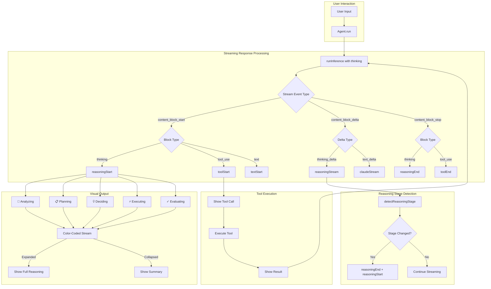
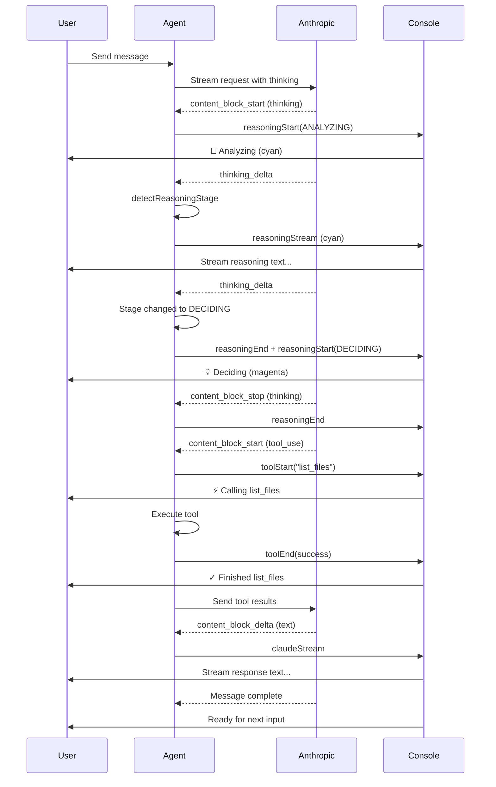
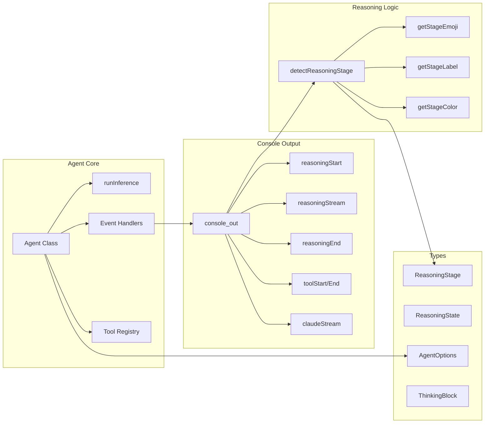
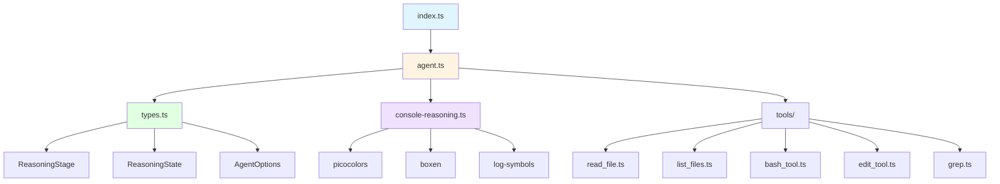
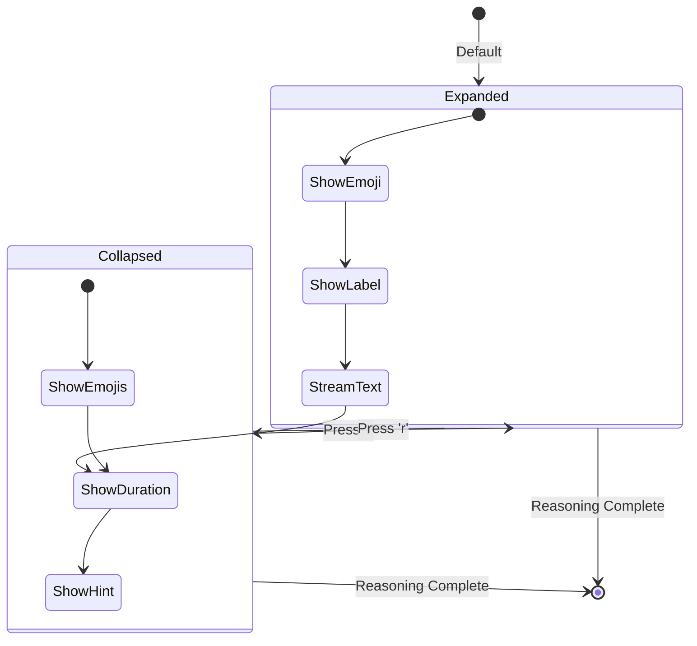
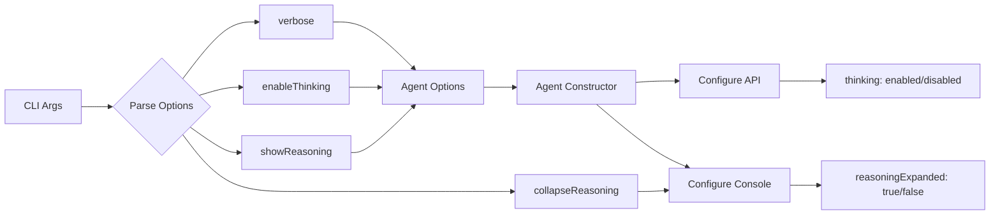

# Chapter 7: Visual Overview

## Reasoning Flow Architecture



## Event Flow Sequence



## Component Architecture



## Stage Visualization

### Reasoning Stages with Visual Indicators

| Stage | Emoji | Color | Trigger Keywords | Purpose |
|-------|-------|-------|------------------|---------|
| **Analyzing** | 🤔 | Cyan | "analyzing", "examining", "looking at" | Understanding the problem |
| **Planning** | 📋 | Blue | "planning", "will", "approach" | Designing solution |
| **Deciding** | 💡 | Magenta | "deciding", "choosing", "considering" | Making choices |
| **Executing** | ⚡ | Yellow | "executing", "running", "calling" | Taking action |
| **Evaluating** | ✓ | Green | "checking", "verifying", "result" | Validating results |

### Example Output (Expanded Mode)

```
You › What files are in the 6-streaming-response directory?

🤔 Thinking: Analyzing
  The user wants to know about files in a specific directory.
  I need to use the list_files tool with the path parameter.

📋 Thinking: Planning
  I'll construct the path and call list_files to get the
  directory contents. Then I'll summarize what I find.

💡 Thinking: Deciding
  Using list_files tool with path "6-streaming-response"

⚡ Calling list_files

✓ Finished list_files

Claude › The 6-streaming-response directory contains:
- agent.ts (main agent class)
- index.ts (entry point)
- types.ts (type definitions)
- tools/ directory with 5 tools
- ripgrep/ directory with utilities

Would you like me to read any of these files?
```

### Example Output (Collapsed Mode)

```
You › What files are in the 6-streaming-response directory?

🤔 📋 💡 Completed in 245ms (press 'r' to expand)

⚡ Calling list_files

✓ Finished list_files

Claude › The 6-streaming-response directory contains:
- agent.ts (main agent class)
- index.ts (entry point)
...
```

## File Dependencies



## Progressive Disclosure States



## Configuration Options Flow



## Backward Compatibility Matrix

| Feature | Chapter 6 | Chapter 7 (default) | Chapter 7 (--no-thinking) |
|---------|-----------|---------------------|----------------------------|
| Streaming text | ✅ | ✅ | ✅ |
| Tool visibility | ✅ | ✅ | ✅ |
| Reasoning display | ❌ | ✅ | ❌ |
| Visual indicators | ❌ | ✅ | ❌ (tools only) |
| Extended thinking | ❌ | ✅ | ❌ |
| Model | Haiku | Sonnet | Sonnet |
| Token budget | 1024 | 8000 + 5000 | 8000 |

## Performance Characteristics

```mermaid
graph TB
    subgraph "Token Usage"
        A[User Message] --> B[Reasoning Tokens: ~500-2000]
        B --> C[Response Tokens: ~200-1000]
        C --> D[Tool Results: ~100-500]
        D --> E[Total: ~800-3500]
    end

    subgraph "Latency"
        F[First Token] --> G[~200-400ms]
        G --> H[Reasoning Complete] --> I[~1-3s]
        I --> J[Response Complete] --> K[~2-5s]
    end

    subgraph "Display Performance"
        L[Stream Rendering] --> M[~16ms/frame]
        M --> N[Stage Detection] --> O[~1ms]
        O --> P[Color Rendering] --> Q[~0.1ms]
    end
```



## Summary

Chapter 7 provides:

1. **Visual Transparency**: See Claude's thinking process in real-time
2. **Stage-based Display**: 5 distinct reasoning stages with unique indicators
3. **Progressive Disclosure**: Expand/collapse reasoning for different detail levels
4. **Tool Reasoning**: Understand why tools are being called
5. **Backward Compatible**: Works seamlessly with Chapter 6 code

The architecture maintains clean separation between:
- **Capture** (Agent): Getting reasoning from API
- **Detection** (Logic): Identifying reasoning stages
- **Display** (Console): Visualizing with colors and emojis
- **Configuration** (Options): Controlling behavior

This design makes the AI's decision-making process transparent while keeping the codebase maintainable and extensible.
